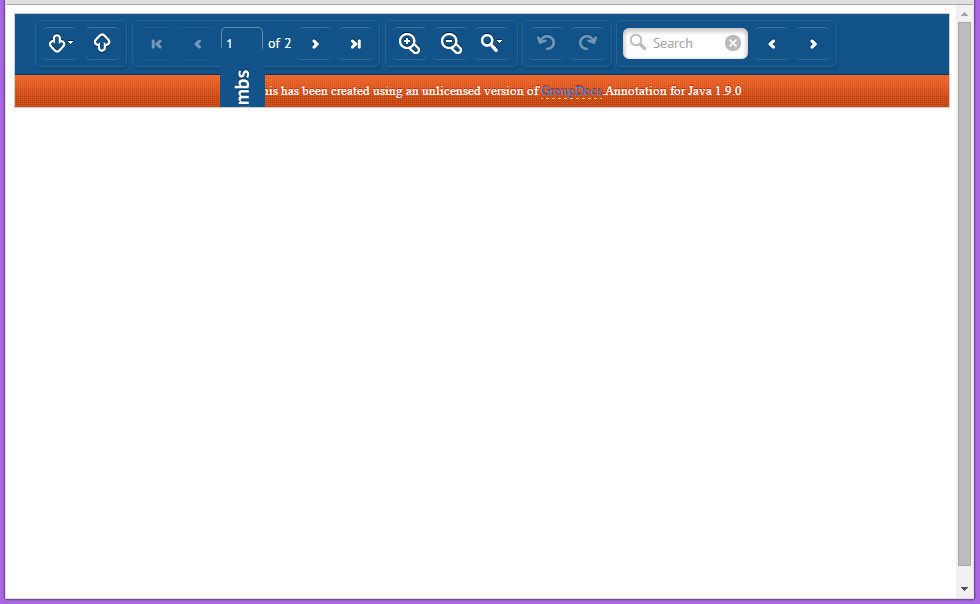

# wicket-groupdocs
GroupDocs example app using Wicket Framework

## Configuration on Eclipse IDE
* Create a directory on `C:/temp/documentos-exemplo/` and put a PDF file named `pdf.pdf` on it. An alternative is to create a PDF file wherever you want and change the properties `groupdocs.annotation.defaultFileName` and `groupdocs.annotation.basePath` on file `group-docs.properties`
* Execute `mvn eclipse:eclipse`
* Execute `mvn install`

## Running the project

### To run the project using a simple JSP without Wicket Framework
* Open `web.xml` and change the following lines:
  * Comment the Wicket Servlet mapping on lines 72-75
  * Uncomment IndexServlet mappings on lines 83-86
* On Eclipse IDE, run class `br.com.dataeasy.chronus.web.JettyTeste` **as a Java Application**
* Open you browser at URL http://localhost:8080/chronus/visualizador/teste
* Note that the viewer works

### To run the project using Wicket Framework with HTML
* Open `web.xml` and change the following lines:
  * Uncomment the Wicket Servlet mapping on lines 72-75
  * Comment IndexServlet mappings on lines 83-86
* On Eclipse IDE, run class `br.com.dataeasy.chronus.web.JettyTeste` **as a Java Application**
* Open you browser at URL http://localhost:8080/chronus/visualizador/teste
  * The mapping to `/visualizador/teste` path is configured on class `br.com.dataeasy.chronus.web.wicket.bookmarkable.TestBookmarkablePages`

#### Error image
Here's the image showing the viewer with error. The toolbar is shown, but the image is not rendered.

